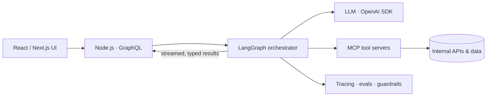

  

  

  
  
  

---

## About

I'm a senior engineer with 6+ years of experience building frontend platforms and full-stack products. I care about the parts users never notice but always feel: rendering performance, accessible components, predictable state, and API contracts that let teams move independently.

More and more of my work is in **AI and agentic systems**. I design agent workflows with LangGraph, the OpenAI SDK, and the Model Context Protocol (MCP), and I build them to production standards: typed, observable, testable, and integrated into the product experience.

---

## Tech stack

   
  

| Area | Technologies |
|---|---|
| **Frontend** | React, TypeScript, Next.js, Vue.js, design systems, accessibility, web performance |
| **Backend & APIs** | Node.js, GraphQL, REST, serverless (AWS Lambda) |
| **AI / Agentic** | LangGraph, OpenAI SDK, Model Context Protocol (MCP), tool calling, evaluation |
| **Cloud & Delivery** | AWS, Azure, Docker, CI/CD, Jest |

---

## How I architect AI features

The model is just one component. The engineering work lives in the parts around it: typed tool contracts, streaming UI, fallbacks, and evaluation.

---

## Engineering principles

<b>Performance is a product feature</b>

 

Profile before optimizing. Most React performance problems come from where state lives, not from missing `useMemo`. I track Core Web Vitals and interaction latency as first-class metrics, with budgets enforced in CI.

<b>Treat LLMs as unreliable I/O</b>

 

Every model call gets schema-validated outputs, timeouts, retries, and a deterministic fallback path. Agent behavior is covered by evals and traces, so a regression gets caught before a user sees it.

<b>Platforms win on adoption, not component count</b>

 

A design system or shared frontend platform is only as good as its developer experience: clear APIs, strong typing, documentation, and a migration path. I optimize for the teams who consume it.

<b>Contracts before code</b>

 

A well-designed GraphQL schema or MCP tool interface lets frontend, backend, and AI work proceed in parallel. I invest early in the interface, because it outlives the implementation.

---

## Currently focused on

- Agentic workflows that are **reliable in production**, not just impressive in demos
- Frontend architecture for **streaming, AI-driven interfaces**
- Scalable component systems and **developer experience**

---

  Open to conversations about frontend architecture, AI systems, and engineering leadership. 
  <a href="https://www.linkedin.com/in/aishwerya/"><b>Connect on LinkedIn →</b></a>

  

